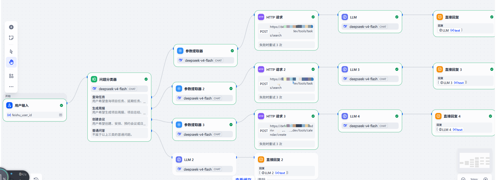
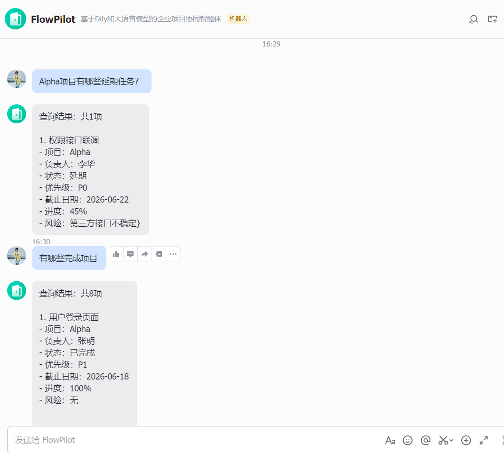
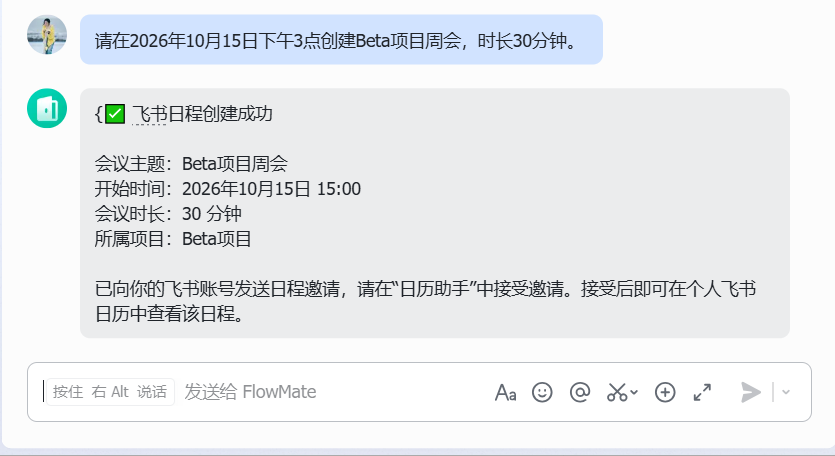
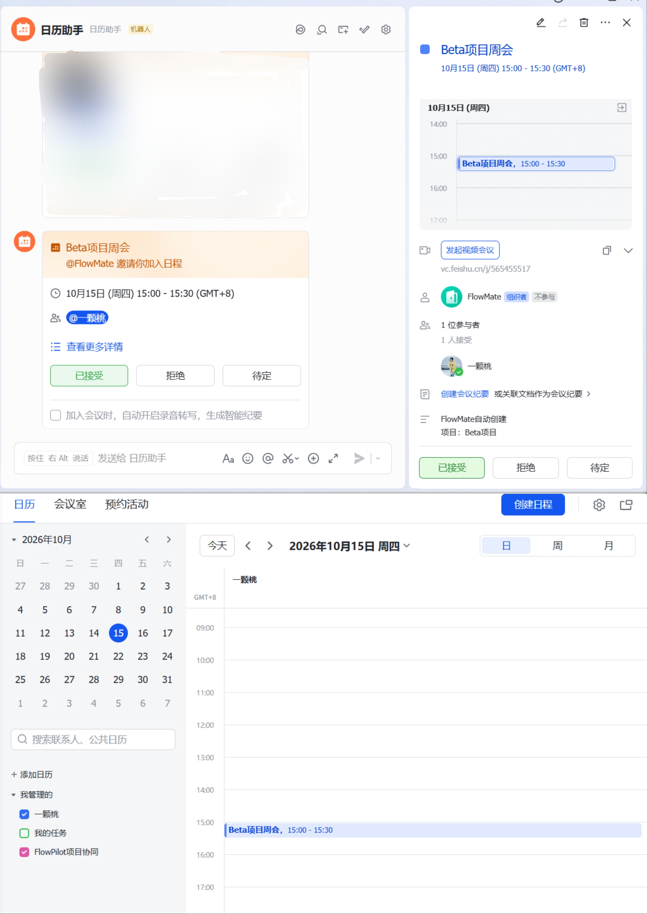

# FlowMate

> 基于 Dify、FastAPI 与飞书开放平台构建的企业项目协同智能体

FlowMate 是一个面向企业协作场景的 AI Agent 个人项目。用户可以直接在飞书中使用自然语言查询项目任务、筛选项目状态、生成项目周报，并通过自然语言创建飞书日程。

系统通过 **Dify** 进行意图识别、参数提取和工作流编排，并通过 **Python + FastAPI** 封装飞书业务接口，并接入飞书机器人、多维表格与日历 API，将大语言模型能力连接到真实企业协作工具。

---

## 🎬 Demo Video

点击下方图片观看FlowMate 5 分钟项目演示：

[](https://m.bilibili.com/video/BV1rAYm6HEXQ)

Demo 展示内容：

1. 飞书自然语言任务查询
2. 项目周报生成
3. 自然语言会议创建
4. 日历助手收到真实会议邀请
5. Dify 工作流展示
6. FastAPI 后端调用过程

---


## ✨ 核心功能

### 1. 项目任务查询

用户可以直接通过自然语言查询项目数据，例如：

```text
Alpha项目有哪些延期任务？
```

FlowMate 会识别用户意图和项目参数，通过 FastAPI 查询飞书多维表格，并返回对应任务信息。

支持的典型查询包括：

* 查询指定项目任务
* 查询延期任务
* 查询不同任务状态
* 查询项目负责人相关任务
* 查询项目进度信息

---

### 2. 项目周报生成

用户可以输入：

```text
生成Alpha项目周报
```

FlowMate 从飞书多维表格获取项目任务数据，并结合大语言模型生成结构化项目周报。

---

### 3. 自然语言创建飞书日程

用户可以直接输入：

```text
请在2026年10月15日下午3点创建Beta项目周会，时长30分钟
```

系统会自动完成：

```text
用户自然语言输入
        ↓
Dify识别创建会议意图
        ↓
提取会议标题、时间、时长和项目
        ↓
HTTP调用FastAPI
        ↓
FastAPI调用飞书Calendar API
        ↓
创建真实飞书日程
        ↓
获取当前飞书用户Open ID
        ↓
将用户添加为日程参与人
        ↓
飞书日历助手发送会议邀请
```

用户接受邀请后，即可在个人飞书日历中查看会议。

---

## 🏗️ 系统架构

```text
┌─────────────────────┐
│      飞书用户        │
│  Natural Language   │
└──────────┬──────────┘
           │
           ▼
┌─────────────────────┐
│     飞书机器人       │
│   Message Event     │
└──────────┬──────────┘
           │
           ▼
┌─────────────────────┐
│     Python Bot      │
│  获取sender_open_id │
│    调用Dify API     │
└──────────┬──────────┘
           │
           ▼
┌─────────────────────┐
│        Dify         │
│  Intent Routing     │
│ Parameter Extractor │
│       LLM           │
│   HTTP Tool Call    │
└──────────┬──────────┘
           │
           ▼
┌─────────────────────┐
│      FastAPI        │
│    Business API     │
│   参数校验 / 鉴权    │
└───────┬─────┬───────┘
        │     │
        ▼     ▼
┌──────────────┐   ┌──────────────┐
│ 飞书多维表格  │   │  飞书日历API  │
│ Task Data    │   │ Calendar API │
└──────────────┘   └──────────────┘
```

---

## 🧠 Dify 工作流

FlowMate 使用 Dify Chatflow 对用户请求进行工作流编排。

主要节点包括：

```text
用户输入
   ↓
问题分类器
   ↓
参数提取器
   ↓
HTTP Request
   ↓
LLM
   ↓
直接回复
```

不同意图会进入不同分支，例如：

```text
任务查询
项目周报
创建会议
普通问答
```

---

## 🔧 技术栈

### AI / Agent

* Dify
* Large Language Model
* Intent Classification
* Parameter Extraction
* Workflow Orchestration
* Tool Calling

### Backend

* Python
* FastAPI
* HTTPX
* REST API
* python-dotenv

### Feishu / Lark

* 飞书开放平台
* 飞书机器人
* 飞书消息事件
* 飞书多维表格 API
* 飞书 Calendar API
* Open ID 用户身份传递

### Development

* VS Code
* ngrok
* Git / GitHub

---

## 📁 项目结构

```text
flowmate/
│
├─ app/
│  ├─ api.py
│  ├─ bot.py
│  ├─ lark_channel.py
│  └─ __init__.py
│
├─ screenshots/
|  ├─ demo-cover.png
│  ├─ dify-workflow.png
│  ├─ task-query.png
│  ├─ calendar-create.png
│  └─ calendar-invite.png
|
├─ .env.example
├─ .gitignore
├─ requirements.txt
└─ README.md
```

### 文件说明

`api.py`

负责 FastAPI 服务以及飞书业务工具接口，包括：

* 多维表格任务查询
* 飞书 Token 获取
* 日历事件创建
* 日程参与人添加
* 接口参数校验

`bot.py`

负责：

* 接收飞书机器人消息
* 调用 Dify API
* 将 Dify 返回结果发送回飞书
* 传递当前飞书用户身份

`lark_channel.py`

负责：

* 飞书 WebSocket 连接
* 飞书消息事件解析
* 获取 `chat_id`
* 获取 `sender_open_id`
* 飞书消息发送

---

## 📊 数据说明

本项目使用自行构造的项目管理模拟数据进行功能验证。

当前飞书多维表格包含约 **32 条任务级测试数据**，覆盖：

* 不同项目
* 不同负责人
* 不同任务状态
* 不同优先级
* 不同截止时间
* 不同项目进度

这些数据主要用于验证：

```text
任务查询
状态筛选
参数提取
项目周报生成
业务API调用
```

该项目并非机器学习模型训练任务，因此当前重点不是大规模数据量，而是验证 AI Agent 与真实企业协作系统之间的端到端集成能力。

会议功能则实际调用飞书 Calendar API，并能够创建真实飞书日程。

---

## 🚀 本地运行

### 1. 克隆项目

```bash
git clone https://github.com/YOUR_USERNAME/flowmate.git
cd flowmate
```

---

### 2. 创建虚拟环境

Windows：

```bash
python -m venv .venv
```

激活：

```bash
.venv\Scripts\activate
```

---

### 3. 安装依赖

```bash
pip install fastapi uvicorn httpx python-dotenv pydantic lark-oapi lark-channel-sdk
```

---

### 4. 配置环境变量

复制：

```text
.env.example
```

并创建：

```text
.env
```

填写自己的飞书和 Dify 配置：

```env
LARK_APP_ID=
LARK_APP_SECRET=

DIFY_API_KEY=
DIFY_API_BASE=https://api.dify.ai/v1

BITABLE_APP_TOKEN=
BITABLE_TABLE_ID=

FLOWMATE_TOOL_KEY=
FEISHU_CALENDAR_ID=
```

> ⚠️ 不要将真实 `.env`、API Key、App Secret 或 Access Token 提交到公开 GitHub 仓库。

---

## ▶️ 启动项目

FlowMate 当前本地开发环境需要启动三个服务。

### Terminal 1：FastAPI

在虚拟环境下运行启动：

```bash
uvicorn app.api:app --reload --port 8000
```

启动后可以访问：

```text
http://127.0.0.1:8000/docs
```

查看 Swagger API 文档。

---

### Terminal 2：ngrok

启动隧道：

```bash
ngrok http 8000
```
测试访问 https://xxxx.ngrok-free.dev/health，看到 {"status":"ok"} 就说明通了

将本地 FastAPI 服务映射到公网，供 Dify HTTP Request 节点调用。

---

### Terminal 3：飞书机器人

```bash
python -m app.bot
```

连接成功后，飞书机器人即可接收用户消息。

---

## 💬 使用示例

### 示例一：任务查询

用户：

```text
Alpha项目有哪些延期任务？
```

FlowMate：

```text
查询Alpha项目任务数据
→ 筛选延期状态
→ 返回对应任务
```

---

### 示例二：项目周报

用户：

```text
生成Alpha项目周报
```

FlowMate：

```text
读取Alpha项目任务数据
→ 汇总项目状态
→ LLM生成结构化周报
```

---

### 示例三：创建会议

用户：

```text
请在2026年10月15日下午3点创建Beta项目周会，时长30分钟
```

FlowMate：

```text
✅ 飞书日程创建成功

会议主题：Beta项目周会
开始时间：2026-10-15 15:00:00
会议时长：30分钟
所属项目：Beta项目

已向你的飞书账号发送日程邀请，
请在“日历助手”中接受邀请。
```

---

## 🖼️ 项目截图

### Dify Chatflow



---

### 项目任务查询



---

### 自然语言创建飞书会议



---

### 飞书日历邀请




---

## 🐛 开发过程中解决的关键问题

### 飞书日程创建成功，但用户无法访问

开发过程中曾出现：

```text
飞书API返回创建成功
但客户端提示：
“你不在日程中或日程已失效”
```

排查后发现：

```text
tenant_access_token
```

代表的是应用身份。

使用应用身份创建飞书日程后，当前真人用户并不会自动成为该日程的参与人。

因此项目进一步实现了：

```text
飞书消息事件
↓
获取sender_open_id
↓
bot.py传递feishu_user_id传入Dify
↓
Dify透传user_open_id传递给FastAPI
↓
FastAPI创建飞书日程
↓
调用参与人API
↓
添加当前用户
```

最终实现：

```text
创建日程成功
+
参与人添加成功
+
日历助手发送邀请
+
会议进入个人飞书日历
```

该问题涉及：

* 应用身份与用户身份
* chat_id 与 open_id
* API 权限
* Calendar Event
* Attendee Management
* 第三方 API 联调

---

## 🔐 安全设计

项目中的敏感配置全部通过环境变量管理。

不会在源代码中硬编码：

```text
App Secret
Dify API Key
Tool Key
Access Token
```

真实 `.env` 文件已经通过 `.gitignore` 排除。

公开仓库仅提供：

```text
.env.example
```

供用户配置自己的环境。

---

## ⚠️ 当前版本说明

FlowMate 当前版本主要是用于验证 AI Agent 与企业协作系统集成能力的个人 MVP项目。

目前已经实现核心业务闭环，但尚未加入完整生产级能力，例如：

* 多租户权限体系
* 持久化会话数据库
* Human-in-the-loop 写操作审批
* 幂等控制
* Redis
* LangGraph
* 多智能体系统
* Kubernetes 部署

当前会议创建默认将**发起请求的飞书用户**加入参与人。
未来可以结合飞书通讯录或人员字段，根据项目成员和会议类型动态生成多人参与者列表，根据实际企业业务需求继续扩展。

---

## 📈 Future Work

未来可以进一步增加：

* 飞书交互卡片
* 创建会议前人工确认
* 用户角色与权限管理
* 会话持久化
* 写操作幂等控制
* 云端部署
* 更多企业业务工具接入
* MCP 工具服务化
* 更完整的自动化测试体系

---

## 🎯 项目价值

FlowMate 的主要目标不是构建一个只会聊天的机器人，而是验证：

> **Large Language Model + Workflow + Tool Calling + Enterprise API**

如何共同组成一个能够理解用户意图并执行真实业务操作的 AI Agent。

项目目前已经实现：

```text
自然语言输入
→ 意图识别
→ 参数提取
→ 工作流路由
→ HTTP工具调用
→ 企业数据查询
→ 飞书日历写操作
→ 真人用户身份同步
→ 业务结果反馈
```

---

## Author

AI Agent / LLM Application Personal Project

FlowMate — Enterprise Collaboration AI Agent
